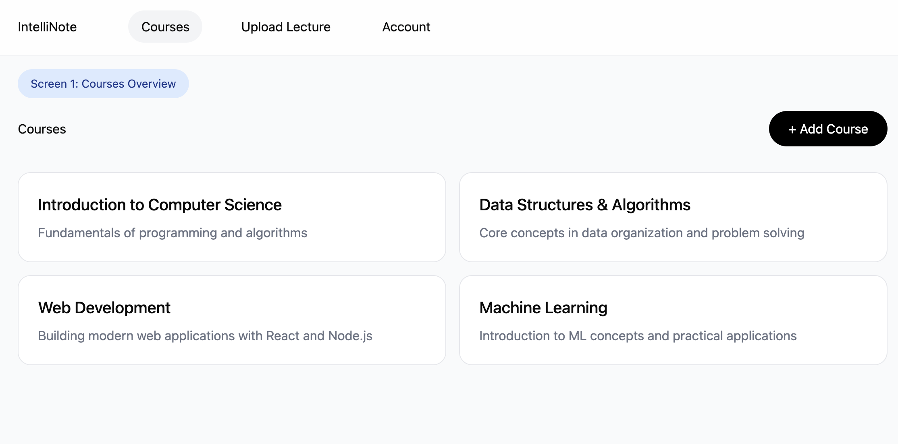
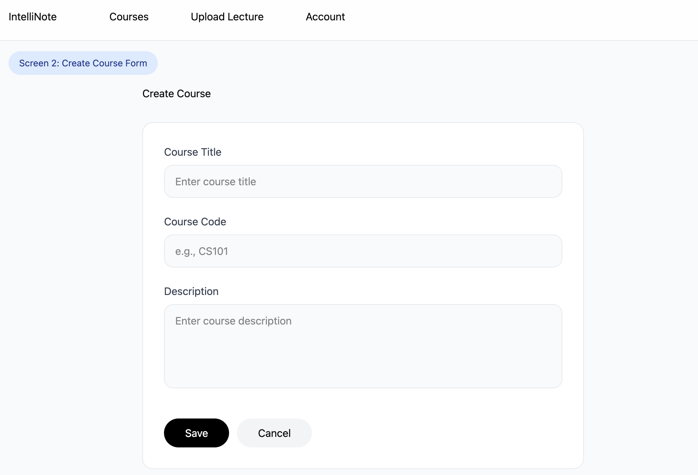
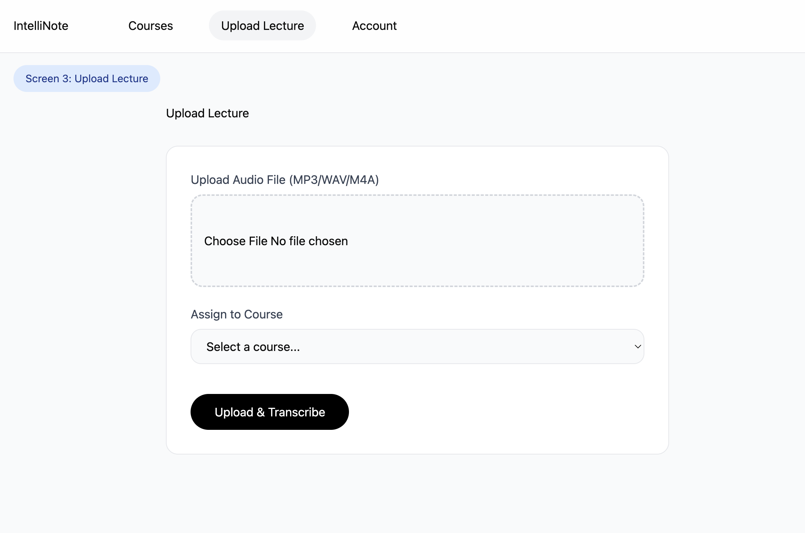
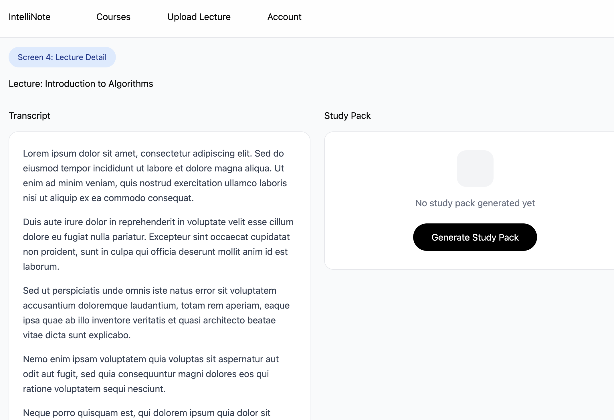
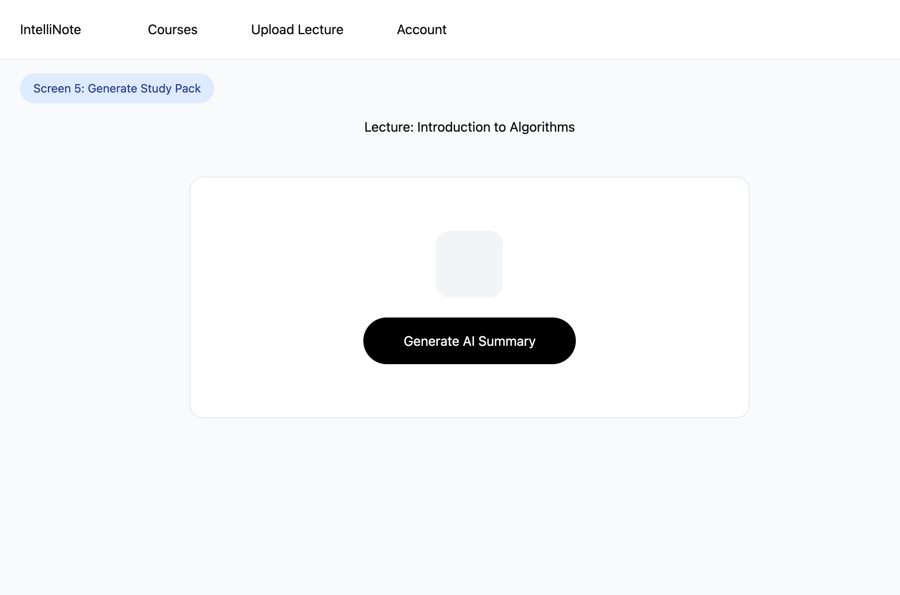
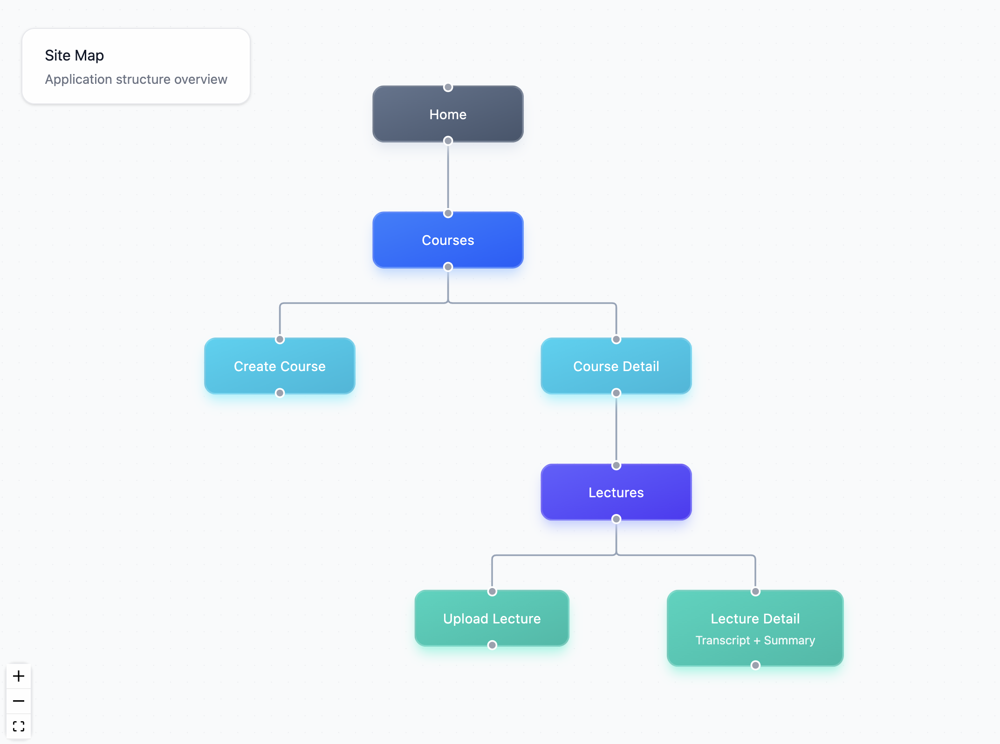

# IntelliNote: AI-Powered Lecture Notetaking Assistant

## Overview

IntelliNote is a web application designed to assist students in **reducing cognitive load** during lectures and studying. Many students struggle to take detailed notes while simultaneously trying to understand explanations, examples, and context. Listening, processing, and writing at the same time often leads to incomplete notes and gaps in understanding.

This application allows students to **upload or record lecture audio**, which is automatically transcribed using Azure Speech-to-Text. The transcript is then processed by **GPT-4o mini** (chosen for its cost/performance balance) to generate clean, structured summaries, key takeaways, and optional study aids such as flashcards or quiz questions. Students can organize their notes into different courses and revisit summaries to reinforce memory retention.

The goal is to improve **comprehension, study efficiency, and retention**—not just generate raw transcripts, but **meaningful, usable notes**.

---

## Data Model

The system will store **Users**, **Courses**, **Lectures**, **Transcripts**, and **Study Packs**.

- A **User** may have multiple **Courses**
- Each **Course** may have multiple **Lectures**
- Each **Lecture** has one **Transcript**
- Each **Lecture** has one generated **Study Pack** (summary, flashcards, etc.)

### Sample Documents

#### User
```js
{
  username: "juan",
  passwordHash: "hashed_password",
  courses: [ObjectId("..."), ObjectId("...")]
}
````

#### Course

```js
{
  user: ObjectId("..."),
  title: "CS-UH 2012 - Software Engineering",
  description: "Lecture and project-based introduction to software engineering.",
  createdAt: "2025-10-29T20:20:32.000Z"
}
```

#### Lecture

```js
{
  courseId: ObjectId("..."),
  title: "Week 3 - Event Loops & Concurrency",
  audioUrl: "/uploads/week3.m4a",
  status: "processed", // uploaded | transcribed | processed
  createdAt: "2025-10-29T21:10:12.000Z"
}
```

#### Transcript

```js
{
  lectureId: ObjectId("..."),
  text: "Full transcript text...",
  segments: [
    { start: 0.0, end: 4.2, text: "Today we'll cover event loops..." }
  ]
}
```

#### StudyPack

```js
{
  lectureId: ObjectId("..."),
  summary: "This lecture introduces event loops...",
  keyPoints: [
    "JavaScript is single-threaded",
    "Concurrency is handled through callbacks, promises and async/await"
  ],
  flashcards: [
    { q: "What is the call stack?", a: "The mechanism JavaScript uses to keep track of function execution." }
  ],
  quiz: [
    { question: "Which of the following manages async callbacks?", choices: ["Heap", "Queue", "Call Stack", "Thread Pool"], answerIndex: 1 }
  ]
}
```

---

## Link to First Draft Schema

A first draft of schemas will be located in:
**`/models/*.js`**

(Will be included in the repository as part of milestone submission.)

---

## Wireframes

Planned Screens:

| Page                       | Description                     |
| -------------------------- | ------------------------------- |
| `/courses`                 | List of all courses             |
| `/courses/create`          | Form to add a new course        |
| `/lectures/upload`         | Upload audio + assign to course |
| `/lectures/:id`            | View transcript + study pack    |
| `/lectures/:id/study-pack` | Generate AI summary button      |

### Wireframe Images












---

## Site Map



```
Home
 └── Courses
      ├── Create Course
      └── Course Detail
           └── Lectures
                ├── Upload Lecture
                └── Lecture Detail (Transcript + Summary)
```

---

## User Stories

1. As a **student**, I want to **upload lecture audio** so that I don’t have to write notes in real time.
2. As a **student**, I want to **see a clean summary and bullet notes** so that I can study efficiently.
3. As a **student**, I want to **generate flashcards and quick quiz questions** to reinforce my understanding.
4. As a **student**, I want to **organize lectures by course** to keep my materials structured.
5. As a **student**, I want to **revisit past summaries** when preparing for exams.

---

## Research Topics (planned total: 10 points)

### React Frontend + Next.js (6 points)

**What is it?**  
React is a JavaScript library for building user interfaces with component-based architecture. Next.js is a React framework that provides server-side rendering, API routes, file-based routing, and optimized production builds.

**Why use it?**  
React enables reusable components and efficient state management, reducing code duplication and improving maintainability. Next.js adds powerful features like automatic code splitting, image optimization, and built-in API routes, which eliminates the need for a separate backend framework. The combination provides a fast, modern development experience and better performance through client-side navigation and server-side rendering.

**Candidate modules/solutions considered:**
- React + Vite (simpler setup, but missing SSR and routing features)
- Vue.js (alternative framework, but less ecosystem for Next.js features)
- Plain server-side rendering (worse UX, slower page transitions)

---

### shadcn/ui (1 point)

**What is it?**  
shadcn/ui is a collection of accessible, customizable React components built on Radix UI primitives and styled with TailwindCSS. Unlike traditional component libraries, you copy components into your project rather than installing them as dependencies.

**Why use it?**  
It provides professionally designed, accessible components out of the box while allowing full customization since the code lives in your project. This approach gives the benefits of a component library (consistency, accessibility) with the flexibility of custom code. The TailwindCSS styling ensures modern, responsive designs with minimal CSS.

**Candidate modules/solutions considered:**
- Material-UI / MUI (more opinionated, heavier bundle size)
- Chakra UI (good alternative, but less customizable)
- Custom components (more time-consuming, inconsistent design)

---

### Azure Speech-to-Text API (2 points)

**What is it?**  
Azure Speech-to-Text is a cloud service from Microsoft that converts spoken audio into written text. It supports real-time and batch transcription, multiple languages, and can handle long-form audio files.

**Why use it?**  
This API provides accurate transcription of lecture recordings without requiring local processing power or training custom models. It handles various audio formats, background noise, and speaker recognition. The batch transcription feature is ideal for processing longer lecture recordings that students upload.

**Candidate modules/solutions considered:**
- Google Cloud Speech-to-Text (similar features, but Azure was chosen for consistency)
- OpenAI Whisper API (good accuracy, but more expensive for long files)
- Local transcription libraries (less accurate, requires significant processing power)

---

### GPT-4o mini (OpenAI API) (1 point)

**What is it?**  
GPT-4o mini is OpenAI's efficient language model optimized for cost and speed while maintaining strong reasoning capabilities. It can generate structured text, summaries, and follow instructions for creating flashcards and quiz questions.

**Why use it?**  
This model provides excellent cost/performance balance for generating multiple study materials from transcripts. It's much cheaper than GPT-4 while still producing high-quality summaries and structured outputs. The API is well-documented and easy to integrate, making it ideal for transforming raw transcripts into useful study aids.

**Candidate modules/solutions considered:**
- GPT-4 (higher quality but 15x more expensive)
- Claude (comparable performance, but GPT-4o mini is more cost-effective)
- Local LLMs (requires significant infrastructure, less reliable)

---

**Total:** 10 points

---

## Initial Main Project File

`app.mjs` will contain:

* Express server setup
* Logging middleware
* Basic route placeholders
* MongoDB connection setup

---

## References Used

This README structure is based on the sample final project documentation:

- Azure Speech SDK Docs: [https://learn.microsoft.com/azure/cognitive-services/speech-service/](https://learn.microsoft.com/azure/cognitive-services/speech-service/)
- React Docs: [https://react.dev](https://react.dev)
- shadcn/ui Documentation: [https://ui.shadcn.com](https://ui.shadcn.com)
- OpenAI API Documentation: [https://platform.openai.com/docs](https://platform.openai.com/docs)

---
